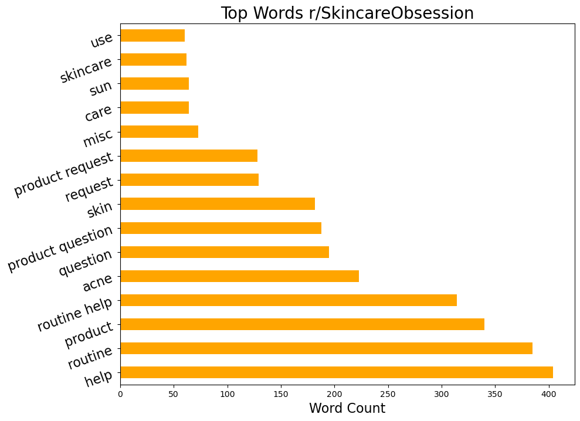
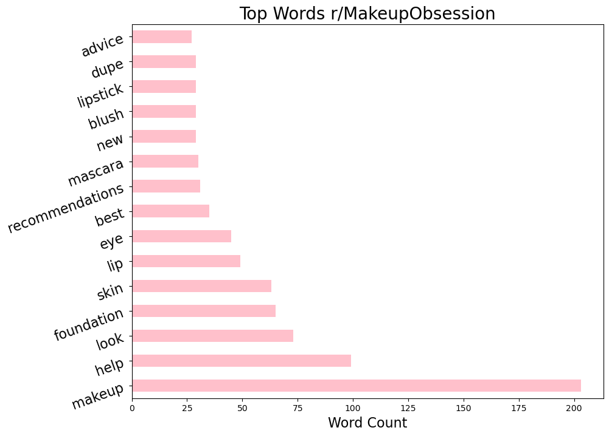

# Binary Classification of Subreddit Posts: r/SkincareObsession & r/MakeupObsession

### Overview
---
SkinBeauty, a skincare & makeup products company, aims to enhance its marketing strategies by building a model to classify Reddit posts from two popular beauty-related subreddits: /r/SkincareAddiction and /r/MakeupAddiction. By accurately classifying posts based on their titles, SkinBeauty seeks to gain insights into the distinct interests and needs of individuals seeking skincare advice versus those interested in makeup tips and trends. The ultimate goal is to optimize marketing efforts and tailor product offerings to better serve these two distinct customer segments.

### Data Dictionary
---
| Feature     | Type     | Description             |
|-------------|----------|-------------------------|
| created_utc   | integer   | The timestamp of when the Reddit post was created|
| title   | string   | The title of the Reddit post|
| self-text   | string   | The text content of the Reddit post|
| subreddit   | integer   | The source subreddit; 1= Skincare, 0= Makeup|

### Executive Summary
---
The objectives of this project are as follows:

1. Collect and analyze posts from two subreddits: "r/SkincareObsession" and "r/MakeupObsession" 
2. Develop a classification model that accurately predicts which subreddit a post belongs to based on its  text content.
3. Provide SkinBeauty with insights and recommendations based on this analysis that will enhance their marketing and product strategies.
   
Data was scraped from Reddit using the PRAW library. After data cleaning and EDA, two binary classification models were created: logistic regression & extra tree classifiers.

Data Sources:

* www.reddit.com/r/SkincareObession/
* www.reddit.com/r/MakeupObsession/

### Data Overview 
---
The PRAW Library was utilized to collect a total of 1,912 posts from /r/SkincareObsession and /r/MakeupObsession. The proportion of data collected was roughly equally split between these two  subreddits. 

The 15 most common words by subreddit also show notable differences. Top words within the Skincare subreddit include routine, product, and acne -- compared to top words in the Makeup subreddit, which included makeup, look, and foundation. Interestingly, one top word shared in common between the two threads was "help"

### Model Optimization & Evauluation 
---
Two different classification models were created. Below are valuation metrics for each model, including accuracy, recall, precision and F1 score. My takeaway from this is that these two subreddit threads are actually a lot more differentiable than I anticipated. I thought it would be more difficult for the model to tell them apart, but apparently not given the high accuracy scores. I even tried taking out the word 'makeup' which I suspected might be a give-away word, but doing so did not change the accuracy score.

| Model                                   | Accuracy | Recall | Precision | F1   |
|-----------------------------------------|----------|--------|-----------|------|
| Logistic Regression                     | 97.39%  | 97.41%  | 97.35%     | 0.97 |
| Random Forest                           | 97.1%    | 97.73%  | 97.64%     | 0.97 |

### Conclusion & Recommendations
---
In conclusion, I would recommend the use of the logistic regression model for three reasons. Firstly, it had the highest accuracy score compared to the Random Forest model. Secondly, it is easily interpreted. Lastly, it is less computationally intensive than other models. As far as marketing recommendations, I would point out that in the makeup thread, the word "foundation" appeared more frequenty than any other type of makeup, and in the skincare thread, the word "acne" appeared more frequently than any other type of skincare concern. Therefore, I would recommend that SkinBeauty invest more research and development into products like foundation and products that will also address acne.

 
